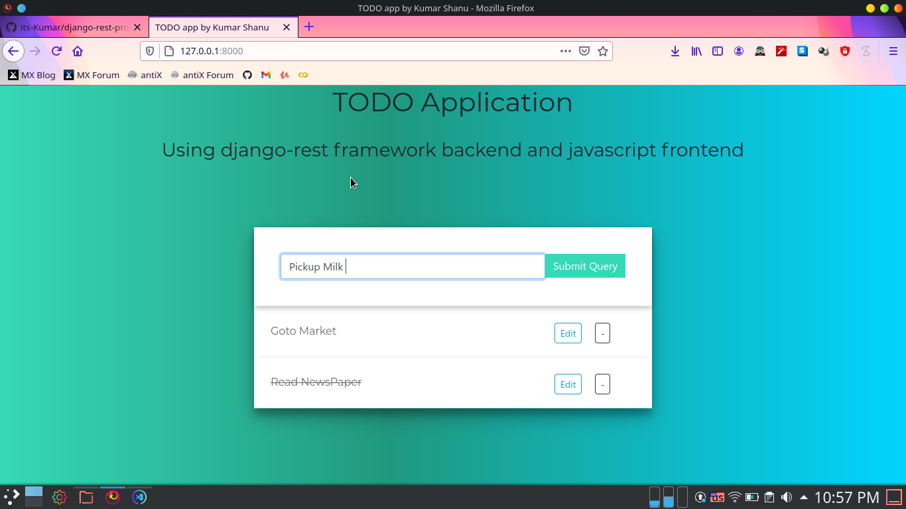

# django-rest-project

## TODO App

Build simple ToDo web application using django-rest framework and javascript frontend using CRUD functionality.

## Screenshot



## Steps

1. `pip install django`
2. `pip install djangorestframework`
3. `python manage.py startproject project_name`
4. `python manage.py startapp api`
5. Add newely created app(api) to INSTALLED_APPS
```
INSTALLED_APPS = [
    .....
    'api',

    ....
    'frontend',
]
```
6. create `searializers.py` file and create serializers for models
7. create api views in `views.py` using CRUD and add urls to `/api/` path
8. create frontend\
`python manage.py startapp frontend`
9. create template for frontend and add frontend code
10. finally create database and runserver
```bash
python manage.py makemigrations
python manage.py migrate
python manage.py runserver
```

## Author
[Kumar Shanu](https://github.com/its-kumar/)
